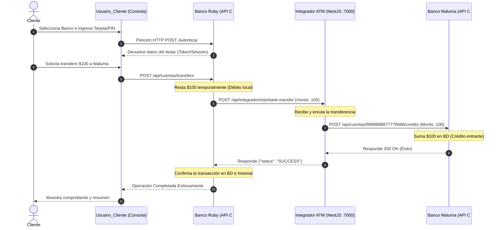

# Guía de Arquitectura, APIs e Integración de la Red Bancaria

Este documento detalla exhaustivamente el funcionamiento interno, diseño de software, flujo de datos, sistema de notificaciones y la relación técnica entre **Banco Ruby**, **Banco Maluma**, el **Usuario Cliente** y el **Integrador ATM**.

---

## 1. Vista General del Ecosistema

El sistema está diseñado para simular una red de cajeros automáticos conectando múltiples entidades financieras a través de un nodo central (el Integrador ATM).



---

## 2. Arquitectura de Banco Ruby (C# / .NET 10)

Banco Ruby está construido utilizando una arquitectura moderna de **Vertical Slice (Rebanadas Verticales)** en lugar de la tradicional arquitectura en capas horizontales.

### A. Estructura de Carpetas del Backend de Banco Ruby
Toda la lógica de la entidad y las operaciones financieras viven dentro de carpetas agrupadas por funcionalidad:
*   `Features/Cuentas/`:
    *   `Application/Commands/`: Manejadores de acciones (mutaciones de datos) como:
        *   `AutenticarCommandHandler.cs`
        *   `DepositarCommandHandler.cs`
        *   `RetirarCommandHandler.cs`
        *   `TransferirCommandHandler.cs`
    *   `Application/Queries/`: Lectura de datos.
    *   `Domain/`: Contiene la lógica del negocio pura:
        *   `Cuenta.cs` (Entidad principal).
        *   `TransferenciaService.cs` (Servicio de Dominio).
    *   `Infrastructure/`: Adaptadores externos:
        *   `TransferenciaGateway.cs` (Cliente HTTP que conecta con el Integrador).
    *   `Endpoint/`: Define los endpoints Minimal API expuestos (`CuentaEndpoint.cs`).

### B. Implementación de CQRS (Command Query Responsibility Segregation) con MediatR
El flujo de solicitudes está desacoplado mediante el uso de la librería **MediatR**:
1.  Cuando la consola o API llama a un endpoint (ej. `POST /api/cuentas/transferir`), el controlador de endpoints envía un comando `new TransferirCommand(...)` al bus de MediatR.
2.  MediatR busca automáticamente el manejador registrado (`TransferirCommandHandler.cs`).
3.  El manejador orquesta el flujo: carga las cuentas desde el repositorio, llama al Servicio de Dominio para validar reglas de negocio, persiste los cambios y retorna la respuesta.

### C. Lógica de Reversión (Rollback) y Consistencia Eventual
Las transferencias interbancarias involucran llamadas de red asíncronas propensas a fallos. Para mitigar esto se aplica la reversión compensatoria en [TransferenciaService.cs](file:///c:/Users/nick_/Desktop/Banco_Ruby-Maluma/Banco_Ruby/Domain/Transferencias/TransferenciaService.cs):
*   Se guarda una copia temporal del saldo inicial del emisor.
*   Se realiza la deducción local en la cuenta de origen.
*   Se ejecuta el callback de red hacia el Integrador.
*   Si la llamada falla (error de red, timeout, 404/500 en el receptor), se captura la excepción y se reasigna el saldo original en la base de datos de Banco Ruby, asegurando consistencia inmediata local.

---

## 3. Funcionamiento de la API e Integración ATM (NestJS)

El **Integrador ATM** en NestJS actúa como el orquestador o "Switch" interbancario central.

### A. Endpoint Creado: `POST /api/integrador/interbank-transfer`
Ubicado en el controlador [integrador.controller.ts](file:///c:/Users/nick_/Desktop/Banco_Ruby-Maluma/isc-atm-integrator-backend-main/isc-atm-integrator-backend-main/src/features/transactions/presentation/integrador.controller.ts):
*   Este endpoint es público y no requiere tokens de navegador (CSRF desactivado).
*   Recibe el siguiente formato de datos (payload):
    ```json
    {
      "cuentaOrigen": "1234567812345678",
      "bancoOrigen": "Banco Ruby",
      "cuentaDestino": "9999888877776666",
      "bancoDestino": "Banco Maluma",
      "monto": 100.0,
      "concepto": "Prueba de envío"
    }
    ```
*   **Enrutamiento Inteligente:** El Integrador lee la variable `bancoDestino`. Si contiene "Maluma", enruta a la URL local de Banco Maluma (`http://localhost:5002`); si contiene "Ruby", enruta a Banco Ruby (`http://localhost:5000`).
*   **Acreditación HTTP:** Lanza un POST a `{bancoDestino}/api/cuentas/{cuentaDestino}/credito` llevando los detalles de la acreditación.
*   **Respuesta de Retorno:** Responde `{ "status": "SUCCESS" }` o `{ "status": "ERROR" }` al banco emisor para finalizar el flujo de transferencia.

---

## 4. Servicio de Notificaciones por Correo (Brevo SMTP)

Banco Ruby cuenta con notificaciones transaccionales por correo electrónico en tiempo real de forma asíncrona:
*   **Librería/Servicio:** `BrevoEmailService.cs`
*   **Configuración:** Consume la API SMTP REST de **Brevo** en `https://api.brevo.com/v3/smtp/email` utilizando la clave de API activa del usuario configurada en `appsettings.json`.
*   **Funcionamiento en segundo plano (`Task.Run`):**
    Para no retrasar la experiencia del usuario en la pantalla del cajero, los correos de confirmación se despachan asíncronamente en hilos de fondo. El manejador de la transferencia retorna el control al cliente de inmediato, mientras que el servicio realiza la llamada HTTP a Brevo de forma paralela.

---

## 5. Arquitectura de Conexión del Cliente (Usuario_Cliente)

La interfaz del cliente interactivo en consola ([CajeroConsole.cs](file:///c:/Users/nick_/Desktop/Banco_Ruby-Maluma/Usuario_Cliente/Services/CajeroConsole.cs)) consume las siguientes APIs REST de los bancos centrales locales:
1.  `POST /cuentas/autenticar`: Envía el número de tarjeta y PIN. Si es correcto, devuelve un Token de sesión y el titular de la cuenta.
2.  `GET /cuentas/{numero}/saldo`: Devuelve el saldo actual disponible en tiempo real.
3.  `POST /cuentas/{numero}/deposito`: Realiza un depósito de fondos en la cuenta indicada.
4.  `POST /cuentas/{numero}/retiro`: Realiza un retiro de efectivo (aplica comisión de $0.41).
5.  `GET /cuentas/{numero}/historial`: Devuelve el listado de transacciones registradas (auditoría).
6.  `POST /cuentas/transferir`: Lanza el comando de transferencia hacia la cuenta y banco especificados.
